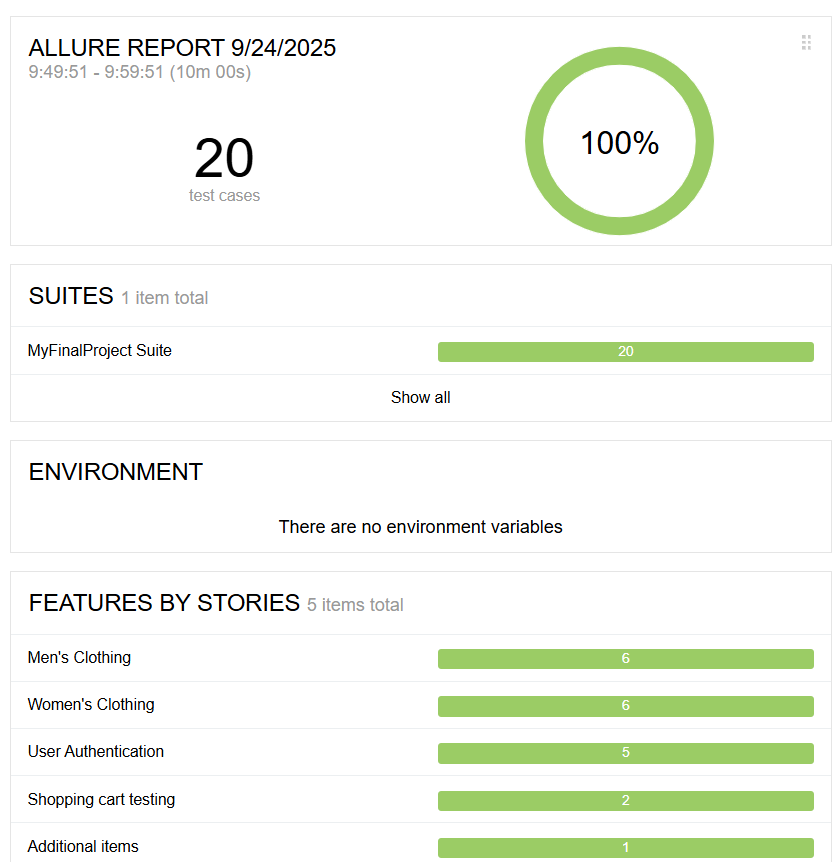
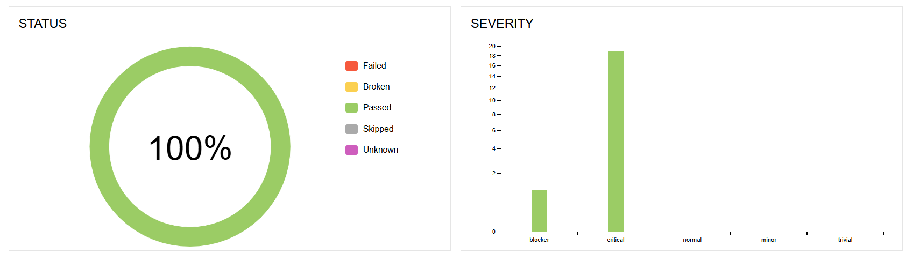
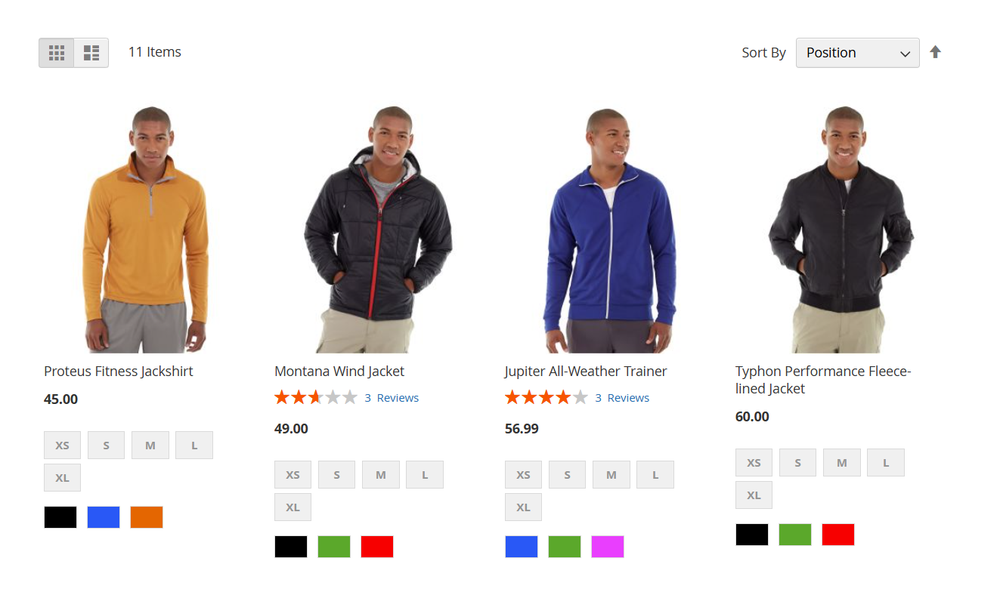
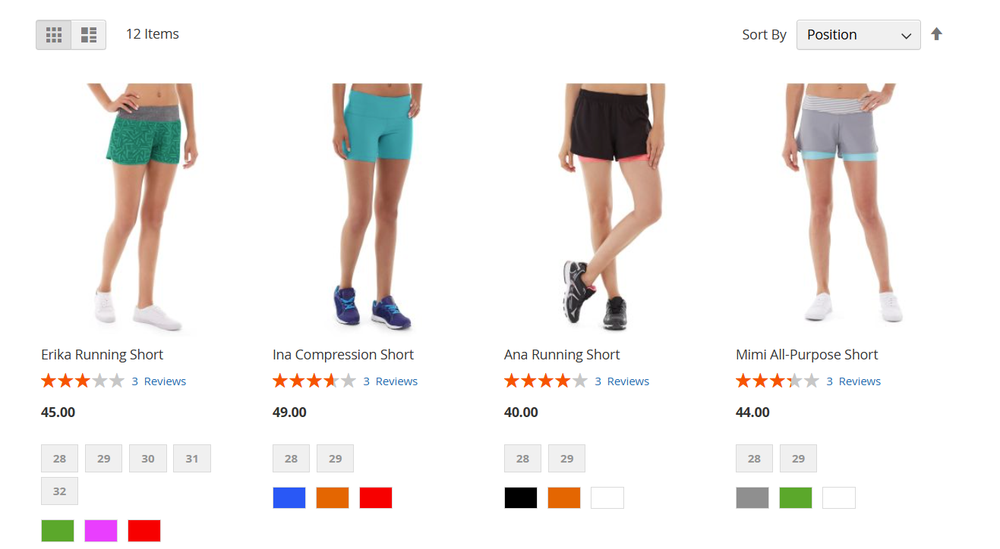
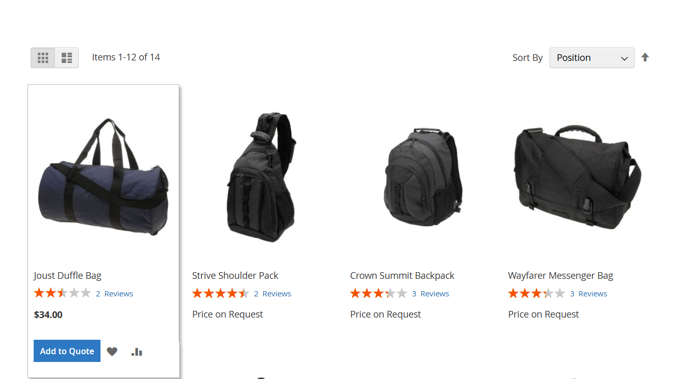
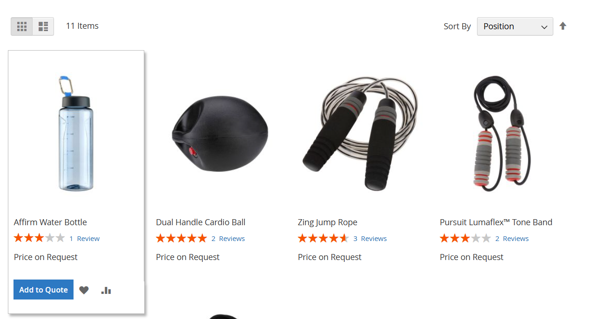
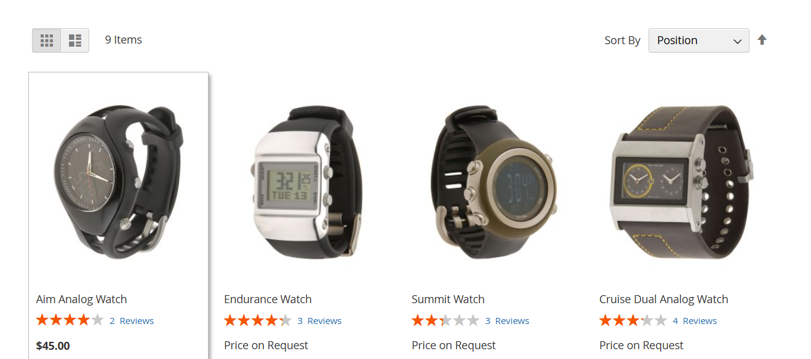

<p align="center">
  
</p>

# 🛒 **Final Project Automation – Selenium & Java**

<p align="center">
  
</p>

<p align="center">
  <a href="https://www.oracle.com/java/technologies/javase-jdk11-downloads.html"></a>
  <a href="https://www.selenium.dev/"></a>
  <a href="https://testng.org/"></a>
  <a href="https://docs.qameta.io/allure/"></a>
</p>

---

## 📚 **Table of Contents**
- [🎯 Project Overview](#project-overview)
- [✨ Features](#features)
- [🏗️ Project Structure (POM)](#project-structure-pom)
- [🛠️ Technologies Used](#technologies-used)
- [🚀 How to Run](#how-to-run)
- [📊 Test Reporting (Allure) — Visuals](#test-reporting-allure-visuals)
- [🖼️ Website Screenshots (Coverage)](#website-screenshots-coverage)
- [💡 Skills Demonstrated](#skills-demonstrated)
- [📈 Project Impact](#project-impact)
- [🙋‍♂️ Author](#author)

---

## 🎯 **Project Overview**

Final project from a Selenium Automation course — a robust, modular end-to-end automation suite for the demo e-commerce application:

🔗 https://demo.cart2quote.com/what-is-new.html

---

## ✨ **Features**

- 🧑‍💼 Men’s sportswear purchase flows  
- 👩‍💼 Women’s sportswear purchase flows  
- 🎒 Bags & gear purchase flows  
- ⌚ Watches purchase flows  
- 🏋️ Sports equipment purchase flows  
- ✅ Product variant selection (size, color)  
- ✅ Add to cart & cart validation  
- ✅ Sign-in / authentication checks  
- ✅ Full checkout flow  
- 📊 Allure reporting integration

---


🎥 Demo Run – Sign In Flow
<p align="center">  </p>

This demo showcases the automated sign-in flow, including field validation, error handling, and successful login simulation.

---

🌐 Live Project Demo
<p align="center"> <a href="docs/finalProjectWebsite.html" target="_blank">  </a> </p>

Explore the full documentation and visual interface of the project through the live demo site.

---
## 🏗️ **Project Structure (POM)**

```
magento.com.pageobject/ 
├── BasePage.java 
├── BagsPage.java 
├── EquipmentPage.java 
├── MenTanksPage.java 
├── MenuToolBar.java 
├── SignInPage.java 
├── WomenHoodiesPage.java 
├── GearPage.java 
├── PaymentsPage.java 
├── MenShortsPage.java

magento.com.tests/ 
├── BaseTest.java 
├── AddToCartTest.java 
├── BuyingMensClothesTest.java 
├── BuyingWomenClothesTest.java 
├── SignInTest.java
```
---

## 🛠️ **Technologies Used**

- **Java 11** – Core language for automation  
- **Selenium WebDriver** – Browser automation  
- **TestNG** – Test orchestration  
- **Maven** – Dependency management  
- **Allure** – Reporting framework  
- **Page Object Model (POM)** – Design pattern for maintainability

---

## 🚀 **How to Run**

### 🔧 Prerequisites
- Java 11 (JDK)  
- Maven  
- ChromeDriver or WebDriverManager  
- (Optional) Allure CLI for local report serving

### ▶️ Run tests
```bash
mvn clean test
```

### 📊 View Allure Report Locally
```bash
allure serve allure-results
```

### 📊 Or generate static report:
```bash
allure generate allure-results --clean -o allure-report
```

---

### 📊 Test Reporting (Allure) — Visuals
<div align="center">   </div>


---

## 🖼️ **Website Screenshots (Coverage)**

<div align="center">

| 🧑‍💼 Men’s Sportswear | 👩‍💼 Women’s Sportswear | 🎒 Bags & Gear | 🏋️ Sports Equipment | ⌚ Watches |
|:--:|:--:|:--:|:--:|:--:|
|  |  |  |  |  |

</div>

---

## 💡 **Skills Demonstrated**
✅ Test automation architecture using Page Object Model (POM)

✅ Integration of Allure for professional test reporting

✅ Modular and scalable test design

✅ Real-world e-commerce flow coverage

✅ Clean code practices and reusable components


---

## 📈 **Project Impact**
🔍 Covers 5 major product categories

🛒 Validates full purchase flow from login to checkout

📸 Includes visual reporting and screenshots

⚙️ Designed for scalability and CI/CD integration

---
## 🙋‍♂️ **Author**

**Omer Bracha**  
📧 omerbrh81@gmail.com  
🔗 [LinkedIn Profile](https://www.linkedin.com/in/omerbracha/)

---
